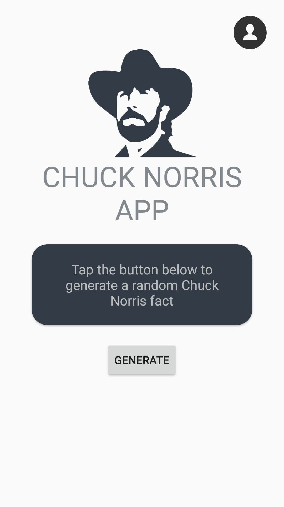
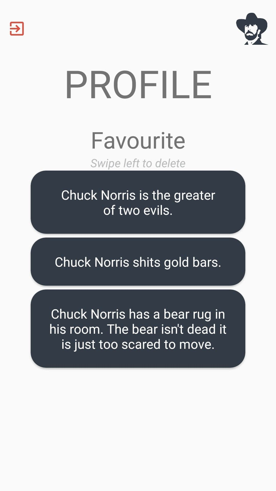

# CHUCK NORRIS APP

Chuck Norris app is an application designed in Kotlin in which you can generate random quotes about the iconic Chuck Norris.
This app has been made during a school project, its purpose is only to learn more about android application development and to make Monsieur Coco laugh.

## Table of content
* [Overview](#overview)
* [Features](#features)
    * [Login Page](#login-page)
    * [Signup Page](#sign-up-page)
    * [Home page](#home-page)
    * [Profile page](#profile-page)
* [Credits](#credits)

## Overview

It's recommended to turn the volume to the maximum to enjoy fully the Chuck Norris App experience. 
Here a video showing a use case of the Norris app : 

## Features

### Login page

This page contains : 
* Two inputs for email and password which display an error when they are not correctly filled
* Sign up button leading to the sign up page
* Forget password button displaying a Chuck's Toast message
* Login button to check the information and to lead to home page

### Sign up page

This page contains : 
* First name input 
* Last name input
* Gender radio buttons 
* email input, its format is verified : required field
* password input : required field
* Birthday data picker 
* Address input 
* City input 
* Country select list

### Home page 

This page contains : 
* Generate button to display a random Chuck Norris quote from the API
* Quote card in which the quotes are displayed (notice the beautiful dancing loader ;) )
* Heart icon to add/remove the quote from your favourite quotes list (you can't add more than 10 quotes to your list)
* Chuck Norris portrait icon : if you are brave enough, you can touch it and see what happens ...
* Profile icon leading to the profile page

### Profile page 

This page contains all the information relative to the connected user.
Here you can find : 
* Logout button leading to the login page
* Chuck Norris portrait icon leading to home page

#### Profile information

This page contains : 
* All the information of the profile
* Heart icon leading to favourites page (the redirection happens only if the favourites list isn't empty)
* Pen icon to modify profile's information and leading to the page below 

#### Profile favourites

This page contains the list of the profile's favourites quotes. 
It's possible to swipe left to delete a quote. 

## Credits

[API used](https://api.chucknorris.io/)
Loader "Dancing Chuck" by jesgrad07
Chuck Norris portrait from [here](https://market.enonic.com/vendors/enonic/chuck-norris-widget)

